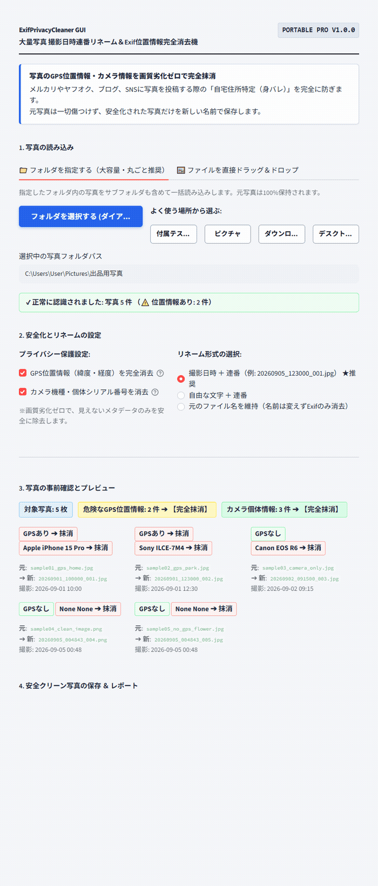

# 【Windows専用】ExifPrivacyCleaner GUI ｜ 写真撮影日時連番リネーム＆Exif位置情報完全消去機

> **「自宅で撮った写真、そのままフリマやSNSにアップしていませんか？」**  
> ドラッグ＆ドロップ3秒。スマホやデジカメ写真に含まれる「自宅のGPS位置情報（緯度・経度）」や「カメラ個体番号」を画質劣化ゼロで完全抹消し、撮影日時順にスマート連番リネームするWindows専用ポータブルGUIツールです。

## ■ 操作デモ（実際の動作）

---

## ■ こんな「プライバシーの不安と管理の手間」、抱えていませんか？

- **メルカリやヤフオク、ブログに自宅で撮った写真を載せるのが怖い**: スマホ写真には目に見えない「撮影場所のGPS座標（自宅の正確な位置）」が自動記録されており、ネット上で自宅が特定される身バレ・空き巣・ストーカー被害の危険がある。
- **写真のファイル名がバラバラで整理がつかない**: `IMG_8492.JPG` や `P102039.JPG` など意味のない英数字が並び、撮影した時系列順に並ばず、ブログや出品用の写真選びに時間がかかる。
- **ネット上の無料Exif削除サイトに大切な写真をアップしたくない**: 家族写真、子どもの写真、未公開の商品写真を海外のWebサーバーにアップロードすることはプライバシー・セキュリティ上絶対に避けたい。
- **Exifを消そうとして画質が落ちてしまう**: 簡易な画像編集ソフトで保存し直すと、JPEGの再圧縮がかかって画像が劣化し、出品写真の魅力が落ちてしまう。

フリマ出品者、ブロガー、SNSユーザー、そしてご家族の写真を守りたいすべての方にとって、位置情報の削除は現代の必須セキュリティです。  
しかし、**「身バレの恐怖」に怯えながら、1枚ずつ手動でプロパティを開いて消去する作業に時間を奪われる必要はありません。**

「ExifPrivacyCleaner GUI」は、大切なプライバシーを100%守りながら、写真整理の手間をゼロにするために開発された、完全実務特化型のポータブルソフトウェアです。

---

## ■ なぜ、他の方法ではなく「ExifPrivacyCleaner」なのか？（4つの圧倒的理由）

### 1. ピクセルを再圧縮しない「画質劣化ゼロのメタデータ完全抹消」
写真の画像データそのものを再圧縮（再エンコード）して粗くすることはありません。  
危険なExifメタデータ（GPS緯度経度・高度、カメラ機種名、製造シリアル番号、撮影者情報）のみをバイナリレベルで綺麗サッパリ完全に消去。**撮影時の最高画質を100%保ったまま、安全なクリーン写真へと仕上げます。**

### 2. 撮影タイムライン順に美しく並び直す「スマート連番リネーム」
写真内部に記録された正確な撮影日時（`DateTimeOriginal`）を自動検出し、時系列順に並べ替えて連番を付与します：
- **撮影日時 ＋ 連番**: `20260905_123000_001.jpg`（撮影した順番にピシッと並ぶ）
- **自由な文字 ＋ 連番**: `商品写真_001.jpg`、`メルカリ出品_001.jpg`（出品管理に最適）
- **元ファイル名維持**: 名前の変更はせず、位置情報のみ安全消去

### 3. 元の写真を傷つけない「完全非破壊出力」
元の写真ファイルを直接上書きしたり消去することは一切ありません。  
同じフォルダ内に **`_安全写真出力/`** フォルダが自動作成され、そこに安全化された写真が新規保存されます。大切なマスターデータはそのまま手元に安全に残ります。

### 4. 完全オフライン動作・機密写真の外部漏洩ゼロ
外部サーバーとのインターネット通信コードは一切組み込まれていません。  
家族のプライベート写真や発売前の商品写真も、お使いのPC内部で100%安全に処理できます。

---

## ■ 作業時間は「1枚ずつ手動」から「3秒」へ（使い方3ステップ）

1. **起動する**: フォルダ内の `ExifPrivacyCleaner.vbs` をダブルクリックします。
2. **放り込む**: 写真フォルダを指定するか、写真をまとめて画面にドラッグ＆ドロップします。
3. **ボタンを押す**: リネーム形式を確認し、**「安全クリーン写真を専用フォルダへ保存」** をクリック！
   - `_安全写真出力/` フォルダへ、位置情報が完全に消え撮影順にリネームされた写真が一瞬で保存されます。
   - Excelで見られる処理結果レポートCSVも保存可能です。

---

## ■ 動作環境・仕様

- **対応OS**: Windows 10 / 11 (64-bit)
- **インストール**: 不要（完全スタンドアロン動作・Embedded Python同梱）
- **対応画像形式**: JPEG / JPG, PNG, TIFF, WEBP等
- **消去対象メタデータ**: GPS情報（緯度・経度・高度）、カメラ機器情報、シリアル番号、撮影者情報
- **安全設計**: 完全オフライン動作・ピクセル非再圧縮・非破壊出力

---

## 🛒 ダウンロード・ご購入のご案内（BOOTH公式ストア）

まずは使い勝手をお手元のPCでお試しいただけるよう、無料Lite版と全機能対応の製品版をご用意しております。

👉 **[BOOTHでダウンロード・購入する](https://nichesoftmakers.booth.pm/items/8809407)**  
- **無料Lite版**: 0円（まずは基本機能や快適な操作感をお試しいただけます）
- **製品版**: **1,280円**（追加課金なしの買い切り・全機能無制限）

動画編集・音声処理・事務自動化など、全ツールの製品版やおトクな業務別バンドルパックも公式BOOTHストアにて公開中です。

---

## 💡 【ご購入・ご利用前に必ずご確認ください】初回起動時のWindows保護画面について

本ソフトは、パソコンのレジストリを変更せず解凍するだけで手軽に使える「ポータブル仕様（インストール不要）」として提供されているため、初回起動時にWindowsの画面に「**WindowsによってPCが保護されました**」という青い確認画面（SmartScreen）が表示される場合があります。

これは、パソコンのレジストリを変更せず手軽に使える未署名のツールに対して、**Windowsが形式上必ず表示する標準的な安全確認画面**です。  
ウイルス等の不正プログラムは一切含まれておらず、インターネット通信も行わない「完全ローカル・安全設計」となっております。

**【解除・起動手順（2クリックで完了します）】**
1. 画面内の **「詳細情報」** をクリックします。
2. 右下に現れる **「実行」** ボタンをクリックします。  
※一度実行すれば、次回以降はこの画面は表示されずスムーズに起動します。

---

## 📄 免責事項・利用規約（ライセンス区分）

- **個人利用を想定**: 本ソフトウェアは個人クリエイター・個人事業主等のPC業務効率化を目的として開発された個人利用専用ツールです。
- **シングルユーザー許諾**: ご購入者様本人（1名）のみ利用可能（ご自身が専属で使用する複数台PCでの利用は許可されます）。組織内での共有・複数名での共同利用・社内共有には対応しておりません。
- 本ソフトウェアは現状有姿（As-Is）で提供され、技術サポート・個別動作保証は行われません。詳細は同梱の `README.txt` をご確認ください。

---

---

## 🔗 公式リンク・関連メディア（相互リンク）

- 🛒 **公式BOOTHストア（製品版・買い切り）**:  
  👉 **[BOOTHで製品版を購入する](https://nichesoftmakers.booth.pm/items/8809407)**  
  全ツールの正規版および、おトクな業務別バンドルパックを公開しています。
- 📝 **公式noteマガジン（全ツールの開発ストーリー・作品カタログ）**:  
  👉 **[公式noteマガジンで全ツール一覧・解説を見る](https://note.com/nichesoftmakers/m/m0609d07d7385)**
- 📘 **開発アーキテクチャ・技術連載（Zenn）**:  
  👉 **[ポータブルGUIツールの設計思想・技術解説](https://zenn.dev/)**
- 📮 **ご意見・不具合報告・機能要望目安箱**:  
  👉 **[ご意見・不具合報告フォーム（完全匿名）](https://forms.gle/2ib5A8EuhpaRs8QSA)**